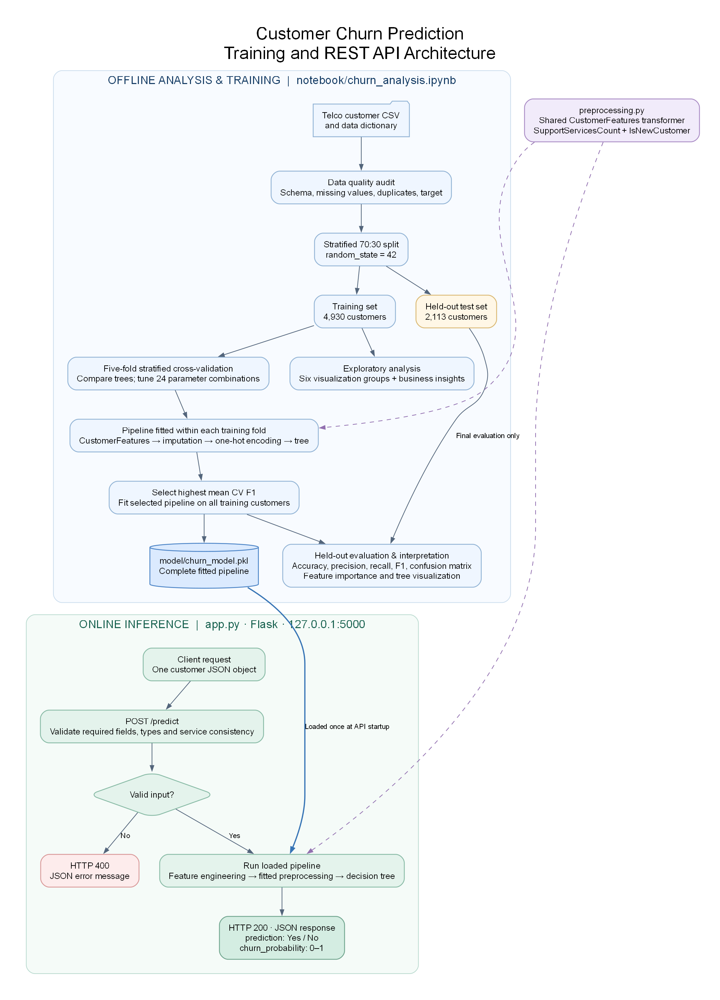

# Customer Churn Prediction

An end-to-end Python solution using the supplied IBM Telco Customer Churn data. The executed notebook contains data checks, six EDA visualizations with business insights, two engineered features, decision-tree comparisons, five-fold hyperparameter tuning and class-weight evaluation, held-out evaluation, and model interpretation.

## Business problem and dataset

A telecommunications retention team needs to identify customers likely to leave so it can prioritize proactive outreach. The target is `Churn`: `Yes` (encoded as 1) or `No` (encoded as 0). Recall matters because missed churners receive no intervention; precision matters because unnecessary calls and offers consume the retention budget. Final model selection uses cross-validation F1 to balance these concerns.

The supplied IBM Telco dataset contains **7,043 customers and 21 columns**: 19 predictors, `customerID`, and the target. There are 1,869 churners (26.54%) and 5,174 non-churners (73.46%). The audit finds no duplicate rows or customer IDs. Eleven blank `TotalCharges` values occur for customers with zero tenure; these are treated as missing and imputed, rather than assumed to be zero. The accompanying data dictionary explains the original fields.

## Architecture



[View full-size image](docs/architecture.png)

Training and inference share the same serialized scikit-learn pipeline. Feature engineering is deterministic; imputation statistics and encoding categories are fitted only on the training portion of each cross-validation fold. The test set is used for final evaluation, not parameter or threshold selection. The saved model remains fitted on the 70% training set, so its reported held-out results can be reproduced. The API performs inference without retraining. Restart the API after regenerating the model so it loads the new artifact.

Workflow: **CSV → audit → split → training EDA and cross-validation → selected fitted pipeline → held-out evaluation and interpretation → saved pipeline → validated API request → prediction and probability**.

## Project structure

The repository root is the project directory (equivalent to `customer_churn_project/` in the suggested submission structure).

```text
Sanjay_Nandaniya_3213327_NAGP_DS_2026/
├── data/
│   ├── TelcoCustomerChurn.csv
│   └── TelcoCustomerChurn - Data Dictionary.csv
├── docs/
│   ├── architecture.png
├── notebook/
│   └── churn_analysis.ipynb
├── model/
│   └── churn_model.pkl
├── app.py
├── preprocessing.py
├── requirements.txt
├── README.md
├── sample_request.json
└── sample_response.json
```

## Demo recording

[Demo Video](https://nagarro-my.sharepoint.com/:v:/p/sanjay_nandaniya/IQAuzqqMaZTaQp2fmublJ21jATo5RM5L3xyN1BPOzQjJVGI?e=GUs5ne)

## Setup

Install Git and Python 3.11, then open PowerShell. Clone the repository and enter the project directory:

```powershell
git clone https://github.com/sanjayN4497/Sanjay_Nandaniya_3213327_NAGP_DS_2026.git
cd Sanjay_Nandaniya_3213327_NAGP_DS_2026
```

Create a virtual environment and install the dependencies:

```powershell
python -m venv .venv
.\.venv\Scripts\python.exe -m pip install -r requirements.txt
```

Run the commands below from this project directory.

## View or rerun the analysis

```powershell
.\.venv\Scripts\python.exe -m notebook notebook/churn_analysis.ipynb
```

Select the virtual environment's Python kernel and run all cells in order. The notebook uses a stratified 70:30 train/test split and `random_state=42`. Model selection and all learned preprocessing use training-only cross-validation. Running all cells recreates `model/churn_model.pkl`, `sample_request.json`, and `sample_response.json`. Outputs are already included in the submitted notebook.

To register the environment as a named kernel if it is not listed:

```powershell
.\.venv\Scripts\python.exe -m ipykernel install --user --name telco-churn --display-name "Python (Telco Churn)"
```

Choose **Python (Telco Churn)** in Jupyter. Keep `preprocessing.py` available with the model: the saved pipeline imports its custom transformer when loaded. Python 3.11 and the dependency versions in `requirements.txt` provide the intended environment; the serialized model was built with scikit-learn 1.7.1.

## Analysis and modelling decisions

The notebook covers churn distribution, churn by contract, internet service and payment method, numerical distributions by churn, and the relationship between tenure and cumulative charges. Each visualization group includes a business insight. Training data shows higher churn among month-to-month customers (42.9%), fiber-optic customers (41.8%), and electronic-check users (45.6%). These are associations that can guide investigation, not proof that changing those attributes prevents churn.

| Pipeline step | Implementation and rationale |
| --- | --- |
| Predictor selection | Exclude `customerID` and `Churn`; use 3 numerical and 16 categorical predictors, treating `SeniorCitizen` as categorical. |
| Feature engineering | `SupportServicesCount` counts `Yes` across online security, online backup, device protection and technical support (0–4), summarizing service engagement. `IsNewCustomer` is 1 for tenure at most 12 months and 0 otherwise, representing first-year onboarding. |
| Numerical preparation | Convert charges and tenure to numeric; impute original and engineered numerical features with training medians. Decision trees do not require scaling. |
| Categorical preparation | Trim text, impute with training modes, and one-hot encode. The encoder handles unseen categories; the API enforces the supported category vocabulary. |
| Model comparison | Compare an unrestricted tree, a regularized tree (`max_depth=5`, `min_samples_leaf=20`), and a tuned tree on the same five stratified folds. |
| Hyperparameter search | Test depths 3/5/7/10, minimum leaf sizes 10/30/60, and class weights `None`/`balanced`: 24 combinations, each evaluated over five folds. |
| Selection | Choose the highest mean CV F1. The selected tree uses `max_depth=5`, `min_samples_leaf=10`, `class_weight='balanced'`, and `random_state=42`. |

## Results and interpretation

These values are recorded in the executed notebook. Precision, recall and F1 refer to `Churn = Yes`.

| Model / evaluation set | Accuracy | Precision | Recall | F1 |
| --- | ---: | ---: | ---: | ---: |
| Unrestricted tree, mean training CV | 0.7312 | 0.4939 | 0.5260 | 0.5093 |
| Regularized tree, mean training CV | 0.7901 | 0.6293 | 0.5161 | 0.5636 |
| Tuned tree, mean training CV | 0.7400 | 0.5087 | 0.7844 | 0.6160 |
| Selected tuned tree, held-out test | 0.7113 | 0.4741 | 0.7986 | 0.5950 |

Held-out confusion matrix (2,113 customers):

| Actual outcome | Predicted No | Predicted Yes |
| --- | ---: | ---: |
| No | 1,055 true negatives | 497 false positives |
| Yes | 113 false negatives | 448 true positives |

The selected model identifies about **80% of churners**, but fewer than half of its alerts correspond to actual churn. Its 71.1% test accuracy is below the approximately 73.5% accuracy of always predicting `No`; that baseline detects no churners. The selected model therefore supports a recall-focused retention workflow, with an explicit cost in unnecessary outreach. The notebook includes the test confusion matrix and explains false positives and false negatives.

The strongest encoded features by impurity importance are month-to-month contract (0.6091), tenure (0.1119), fiber-optic service (0.1014), monthly charges (0.0562), and total charges (0.0315). The notebook includes an importance chart, the first four tree levels, and textual split rules. Importance describes how the fitted tree uses features; it does not establish causation or a direction of effect by itself.

The random split estimates performance on similar customers, not future-period performance. Probabilities are tree leaf estimates affected by class weights and are not calibrated guarantees. No outreach costs, intervention success rates or customer-value assumptions are supplied, so financial return is not estimated. Temporal validation, probability calibration and campaign testing are possible next steps beyond the implemented assignment.

## Run the REST API

```powershell
.\.venv\Scripts\python.exe app.py
```

In a second terminal in the project directory:

```powershell
curl.exe -X POST http://127.0.0.1:5000/predict -H "Content-Type: application/json" --data-binary "@sample_request.json"
```

The exact response for this request is saved in `sample_response.json`. The response contains `prediction` (`Yes` or `No`) and `churn_probability` (0–1, rounded to six decimals).

Sample request (`POST /predict`, `Content-Type: application/json`):

```json
{
  "gender": "Female",
  "SeniorCitizen": 0,
  "Partner": "No",
  "Dependents": "No",
  "PhoneService": "Yes",
  "MultipleLines": "No",
  "InternetService": "Fiber optic",
  "OnlineSecurity": "Yes",
  "OnlineBackup": "No",
  "DeviceProtection": "No",
  "TechSupport": "No",
  "StreamingTV": "Yes",
  "StreamingMovies": "Yes",
  "Contract": "Month-to-month",
  "PaperlessBilling": "Yes",
  "PaymentMethod": "Electronic check",
  "tenure": 18,
  "MonthlyCharges": 96.05,
  "TotalCharges": 1740.7
}
```

Sample response (`HTTP 200`) from the submitted model:

```json
{
  "churn_probability": 0.750078,
  "prediction": "Yes"
}
```

Supply all 19 predictor fields shown in `sample_request.json`; `customerID` is optional and ignored. Use the categorical values in the supplied data dictionary, numeric 0/1 for `SeniorCitizen`, a nonnegative integer for `tenure`, and nonnegative numbers for charges. `TotalCharges` may be null or an empty string and is imputed by the saved pipeline. Other missing fields, invalid values, inconsistent service combinations, unknown fields, and malformed JSON return HTTP 400 with an `error` message. Do not include `Churn` in a request.

### Request field reference

Values are case-sensitive. Submit a single JSON object, not a list of customers. Do not submit the two engineered features; the pipeline creates them.

| Field(s) | Accepted values |
| --- | --- |
| `gender` | `Female`, `Male` |
| `SeniorCitizen` | Numeric `0` or `1`; booleans are rejected |
| `Partner`, `Dependents`, `PhoneService`, `PaperlessBilling` | `Yes`, `No` |
| `MultipleLines` | `Yes`, `No`, `No phone service` |
| `InternetService` | `DSL`, `Fiber optic`, `No` |
| `OnlineSecurity`, `OnlineBackup`, `DeviceProtection`, `TechSupport`, `StreamingTV`, `StreamingMovies` | `Yes`, `No`, `No internet service` |
| `Contract` | `Month-to-month`, `One year`, `Two year` |
| `PaymentMethod` | `Electronic check`, `Mailed check`, `Bank transfer (automatic)`, `Credit card (automatic)` |
| `tenure` | Finite nonnegative whole number of months |
| `MonthlyCharges` | Finite nonnegative JSON number |
| `TotalCharges` | Finite nonnegative JSON number, `null`, or `""`; the field must still be present |

If `PhoneService` is `No`, `MultipleLines` must be `No phone service`; otherwise that value is rejected. If `InternetService` is `No`, all six internet add-on fields must be `No internet service`; otherwise those values are rejected.

For example, setting `tenure` to `-1` returns HTTP 400:

```json
{
  "error": "tenure must be a finite, nonnegative number."
}
```

The endpoint is `POST /predict`; opening `/` in a browser does not invoke prediction. The application runs locally on `127.0.0.1:5000` with Flask debug mode disabled.

### Troubleshooting

If Jupyter reports `FileFindHandler` has no attribute `allowed_symlink_directory`, reinstall the dependencies with `.\.venv\Scripts\python.exe -m pip install -r requirements.txt`, then stop the running notebook server with Ctrl+C and launch it again. The requirements pin Tornado to 6.5.8 to avoid the incompatibility between Tornado 6.5.9 and Jupyter Server 2.21.0. Refresh the browser after restarting.

| Symptom | Resolution |
| --- | --- |
| Missing Python package or wrong notebook kernel | Install `requirements.txt` using the environment's Python executable and select the registered kernel. |
| Missing `model/churn_model.pkl` | Run the notebook from start to finish before launching the API. |
| Model-loading version warning/error | Use the specified environment and scikit-learn version; rerun the notebook if rebuilding under another environment. |
| Connection refused | Keep `app.py` running in the first terminal and call port 5000 from the second. |
| HTTP 400 | Check the returned `error`, required fields, JSON types, category spelling and service consistency. |
| Predictions still reflect an older model | Restart the API after rerunning training; the pipeline is loaded once at startup. |

## Submission files

- `data/`: original dataset and data dictionary.
- `notebook/churn_analysis.ipynb`: executed analysis, model comparison, evaluation, interpretation, and inference checks.
- `preprocessing.py`: reusable feature engineering shared by training and API inference.
- `app.py`: Flask `POST /predict` endpoint, loading the saved pipeline at startup.
- `model/churn_model.pkl`: fitted feature engineering, imputers, encoder, and decision tree.
- `requirements.txt`: Python dependencies.
- `README.md`: project structure, setup, notebook and API execution instructions, and sample API usage.
- `sample_request.json` and `sample_response.json`: verified request and actual API response.

## Workflow coverage

Checked against all four pages of `Data Science Assignment.pdf`. The table maps each requirement to the supplied implementation; the detailed analysis and visual evidence are in the notebook.

| Required stage | Implementation |
| --- | --- |
| Business Problem | Notebook introduction: identify likely churners for retention outreach. |
| Data | Supplied CSV and data dictionary in `data/`; loaded in the notebook. |
| Preparation | Notebook section 1: quality checks, target encoding, stratified split, and training-fitted imputation and encoding. |
| EDA | Notebook section 2: six visualization groups with business insights using training data. |
| Feature Engineering | Notebook section 3 and `preprocessing.py`: `SupportServicesCount` and `IsNewCustomer`. |
| Model | Notebook section 4: unrestricted, regularized, and tuned decision-tree comparisons. |
| Evaluation | Notebook section 5: held-out accuracy, precision, recall, F1, confusion matrix, and business trade-offs. |
| Interpretation | Notebook section 6: feature importance, tree visualization, and split rules. |
| Saved Model | Notebook section 7 and `model/churn_model.pkl`: complete fitted pipeline with reload checks. |
| API | `app.py`: validated `POST /predict`, demonstrated by the sample JSON files and notebook inference checks. |

### Detailed assignment checklist

| PDF requirement | Evidence / status |
| --- | --- |
| 1. Types, structure, missing values, duplicates, numerical/categorical identification and target analysis | Notebook section 1 prints the audit, blank-charge records, feature groups and target counts; explains cleaning decisions. Covered. |
| 1. Encoding, 70:30 split, seed 42 and leakage prevention | Notebook sections 1 and 3 use a stratified split and fold-fitted pipeline shared with inference. Covered. |
| 2. At least five meaningful visualizations with business insights | Section 2 has six groups spanning target, service/customer categories, numeric distributions and relationships. Covered. |
| 3. At least two engineered features with creation and usefulness explained | Section 3 documents `SupportServicesCount` and `IsNewCustomer`; implemented in `preprocessing.py`. Covered. |
| 4. Decision Tree training, at least two configurations, comparison and justified selection | Section 4 compares three configurations using training CV F1. Covered. |
| 5. Accuracy, precision, recall, F1 and confusion matrix | Section 5 reports all five on the untouched test set. Covered. |
| 5. Business interpretation and precision-versus-recall priority | Section 5 explains missed churners, unnecessary outreach and the recall priority. Covered. |
| 6. Importance, top drivers, tree visualization or interpretation and findings | Section 6 includes ranked importance, a chart, tree visualization, split rules and commentary. Covered. |
| 7. Reusable saved model/preprocessing and Flask/FastAPI endpoint | Section 7 saves the full pipeline; Flask loads it at startup. Covered. |
| 7. JSON input, preprocessing, model inference, prediction, probability and invalid-input handling | `POST /predict` and notebook API assertions cover each behavior. Covered. |
| 8. Notebook, Python/API code, saved pipeline, dependencies, README, sample request and response | All required deliverable types are present in the repository. Covered. |
| Bonus activities | Five-fold CV, 24-combination hyperparameter search, balanced class-weight comparison, and serialization/API checks are implemented. |

The supplied PDF describes the directory layout as suggested; this repository uses the project root as `customer_churn_project/`. Before handing in, ensure the notebook outputs, model, data, Python modules and sample JSON files are included and the recipient can access the repository or archive. Add a recording URL only if separately required; none is currently supplied.

Additional activities already implemented include five-fold stratified cross-validation, hyperparameter tuning, evaluation of balanced class weights, comparison of decision-tree configurations, and save/reload and API validation checks.

The notebook checks that saving and loading preserves predictions and probabilities and that the API handles valid and invalid inputs. Recall is prioritized for retention, with F1 used for model selection to balance churn detection and outreach volume. Probabilities are decision-tree estimates rather than calibrated guarantees; the notebook reports the limits of the random-split evaluation.
